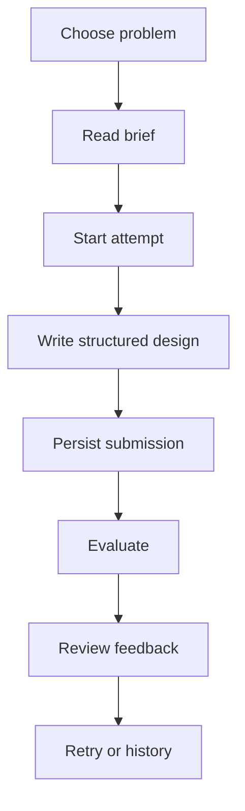
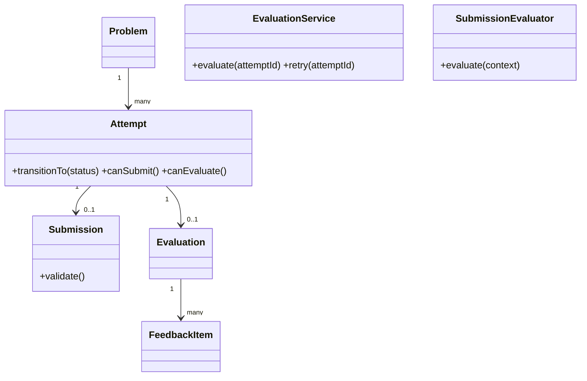

# Design Notes

## MVP scope

Blueprint Lab is a small monolith for one anonymous learner. It owns the practice journey, structured text submissions, evaluation, feedback, history, and retry. It deliberately excludes accounts, admin tooling, UML editing, code execution, distributed workers, and HLD exercises.

## Learner journey

## Domain model

Important classes have a narrow reason to change:

- `Problem` carries a practice brief and its learning context.
- `Attempt` owns valid status transitions instead of letting controllers mutate strings.
- `Submission` normalizes and validates the nine evidence sections.
- `Evaluation` is the aggregate result for one attempt.
- `FeedbackItem` bounds scores and confidence and models one rubric dimension.
- `EvaluationService` coordinates persistence, evaluator invocation, idempotency, failure, and retry.
- `SubmissionEvaluator` is the interface-like contract for evaluation strategies.

## Evaluator abstraction

`EvaluationService` depends on `evaluate(context)`, not on OpenAI. `RuleBasedEvaluator` is the default deterministic implementation. `AIEvaluator` sends the problem, requirements, and submission to OpenAI with a fixed rubric and validates the returned shape before it can be saved. A future `HumanEvaluator` can implement the same method without changing attempt or submission flow.

This is a small Strategy pattern because evaluation policy is the part that varies. A factory or dependency container would add little value at MVP size; the app selects the strategy at composition time in `app.js`.

## Evaluation flow and failure handling

1. Validate the submission before writing it.
2. Persist the submission.
3. Transition the attempt to `SUBMITTED`.
4. Transition to `EVALUATING` and persist the evaluation placeholder.
5. Run the injected evaluator.
6. Save the evaluation and feedback, then transition to `COMPLETED`.
7. On any evaluator/JSON failure, preserve the submission, save a `FAILED` evaluation, and transition the attempt to `FAILED`.
8. A failed attempt can retry evaluation; a completed attempt returns its existing evaluation unless explicitly retried.

The in-memory repository uses an evaluation record keyed by `attemptId` to avoid duplicate records. The `running` set prevents duplicate concurrent starts in one process. A production worker would add a durable uniqueness constraint and idempotency key.

## Persistence and API

The MySQL schema has five focused tables: `problems`, `attempts`, `submissions`, `evaluations`, and `feedback_items`, with foreign keys and indexes. SQL parameters should remain bound values in a production repository implementation.

HTTP concerns stay in `app.js`: status codes, JSON serialization, request size limits, CORS, and safe error messages. Domain/service code owns behaviour.

## Change tests

### A: structured text to class diagram

The submission is already represented as a separate aggregate. A future `submissionType` and `diagramPayload`/file reference can be added to `Submission` and its persistence representation. `Problem`, `Attempt`, and `EvaluationService` continue to operate on a submission contract, so they do not need to know whether evidence came from text or a diagram. The UI can add a diagram editor as another submission component.

### B: AI to rule-based or human evaluation

The current app demonstrates this directly: set `EVALUATOR_TYPE=rule-based` for deterministic checks, or `ai` with `OPENAI_API_KEY` for the AI strategy. A human review adapter could persist a pending evaluation and later call the same completion path.

## Deterministic versus AI feedback

Rules provide instant, repeatable section coverage and make local development reliable. AI adds reasoning about evidence and trade-offs, but can fail, be slow, and require response validation. The product therefore treats structured feedback as the contract, not a specific scoring engine.

## Scale considerations

Persistence is completed before evaluation so a slow or unavailable model cannot lose learner work. If usage grew, the first component to separate would be evaluation execution because it has different latency and retry characteristics. A queue/worker could claim an evaluation by a unique attempt key, while the current monolith remains sufficient for a two-day assignment.
