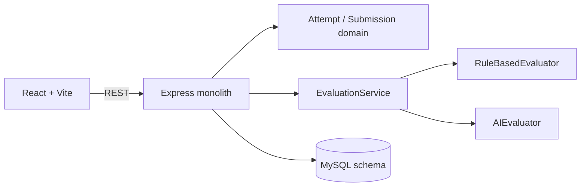

# Blueprint Lab

Blueprint Lab is a focused LLD practice platform for interview-style modelling problems. A learner chooses a brief, starts an attempt, writes a structured design, submits it, receives explainable rubric feedback, and can retry from history.

## Features

- Three seeded problems: Parking Lot, Elevator System, and Vending Machine.
- Structured text submission across nine LLD-focused sections.
- Fixed nine-criterion rubric with evidence, concern, suggestion, and confidence.
- Rule-based evaluator works immediately; OpenAI evaluator is an injectable alternative.
- Attempt state machine: `IN_PROGRESS -> SUBMITTED -> EVALUATING -> COMPLETED|FAILED`.
- Safe failure handling: submitted work remains available when evaluation fails.
- Anonymous local experience, no authentication required.

## Architecture



The runnable default uses an in-memory repository so the app and test suite work without a local database. `database/schema.sql` is the MySQL persistence contract for a local deployment, and the repository boundary is intentionally isolated for swapping persistence.

## Stack and prerequisites

- Node.js 18+
- npm
- MySQL 8+ for persistent local data (optional for the default demo)
- OpenAI API key only when using AI evaluation

## Setup

```powershell
cd lld-practice-platform
npm install
npm install --prefix server
npm install --prefix client
Copy-Item .env.example .env
```

For MySQL, run `database/schema.sql` against your local server. The backend seed module contains the same three problem records used by the default repository.

Environment variables:

- `PORT` (default `4000`)
- `CLIENT_URL` (default `http://localhost:5173`)
- `DB_HOST`, `DB_PORT`, `DB_NAME`, `DB_USER`, `DB_PASSWORD`
- `OPENAI_API_KEY` (never exposed to the browser)
- `EVALUATOR_TYPE=rule-based` or `ai`

## Run

Use two terminals:

```powershell
npm run server
npm run client
```

Or use `npm run dev` if `concurrently` is installed by the root install. Open `http://localhost:5173`.

## Tests and build

```powershell
npm test
npm run build
```

The suite covers domain transitions, submission validation, the API journey, deterministic evaluation, malformed AI responses, evaluator failure, and retry.

## API overview

- `GET /api/problems`
- `GET /api/problems/:id`
- `POST /api/attempts`
- `GET /api/attempts`
- `GET /api/attempts/:id`
- `POST /api/attempts/:id/submission`
- `POST /api/attempts/:id/evaluate`
- `GET /api/attempts/:id/evaluation`
- `POST /api/evaluations/:id/retry`

## Limitations and future improvements

The MVP intentionally uses structured text instead of a UML editor or code execution. We selected structured text because it provides enough evidence of LLD reasoning while keeping the MVP focused. Diagram/code submission can be added later without changing the core Attempt/Evaluation domain. A production version would add a MySQL repository implementation, a background worker for slow AI calls, authentication, richer evaluation calibration, and class-diagram uploads.
