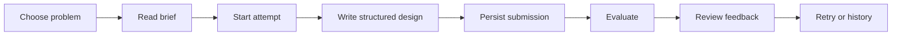
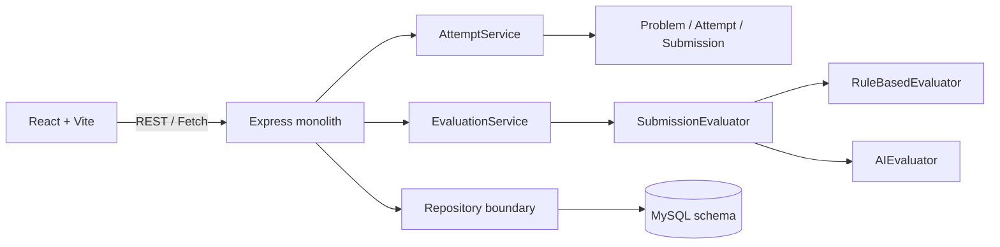

# Blueprint Lab


Blueprint Lab is a focused low-level design practice studio. Learners choose an interview-style system design problem, write a structured solution, submit it for evaluation, review explainable feedback, and retry from their attempt history.

> Build the model before the code.

## Why this project

LLD practice is often done on a whiteboard or in an unstructured chat. That makes it difficult to preserve attempts, compare design decisions, or turn feedback into a repeatable learning loop. Blueprint Lab keeps the MVP deliberately focused on the most useful evidence of LLD reasoning:

- Clear responsibilities and relationships
- Encapsulation, coupling, cohesion, and interfaces
- Extensibility and trade-offs
- Edge cases and testability

## Product tour

| Screen | What it supports |
| --- | --- |
| Problem library | Browse Parking Lot, Elevator System, and Vending Machine |
| Problem brief | Read the scenario, requirements, constraints, and focus areas |
| Practice workspace | Write a structured design in nine guided sections |
| Evaluation | See submitted, evaluating, completed, and failed states |
| Feedback | Review evidence, concerns, suggestions, scores, and confidence |
| Attempt history | Continue in-progress work or revisit completed attempts |

## Screenshots

The screenshot gallery lives in [`docs/screenshots`](docs/screenshots/README.md). Add the provided images using these filenames to render the gallery above and below:


## Core learner journey



## Architecture



The default local runtime uses an in-memory repository so the application starts immediately and the tests do not require MySQL. The MySQL schema is included in [`database/schema.sql`](database/schema.sql), and the repository boundary keeps persistence replaceable.

## Tech stack

- Frontend: React, Vite, React Router, CSS, Fetch API
- Backend: Node.js, Express.js
- Database contract: MySQL 8 and parameterized-query-ready schema
- Evaluation: Rule-based evaluator and optional OpenAI evaluator
- Testing: Jest and Supertest
- Documentation: Markdown and Mermaid

## Prerequisites

- Node.js 18 or newer
- npm
- MySQL 8+ if persistent database storage is required
- OpenAI API key only when using AI evaluation

## Quick start on Windows

From the repository root:

```powershell
cd lld-practice-platform
npm install
npm install --prefix server
npm install --prefix client
Copy-Item .env.example .env
```

Start the backend and frontend in separate terminals:

```powershell
# Terminal 1
npm run server

# Terminal 2
npm run client
```

Open [http://localhost:5173](http://localhost:5173).

You can also run both processes together:

```powershell
npm run dev
```

## Environment configuration

`.env.example` contains the supported configuration:

| Variable | Default | Purpose |
| --- | --- | --- |
| `PORT` | `4000` | Express server port |
| `CLIENT_URL` | `http://localhost:5173` | CORS origin |
| `DB_HOST` | none | MySQL host for a database repository |
| `DB_PORT` | `3306` | MySQL port |
| `DB_NAME` | none | MySQL database name |
| `DB_USER` | none | MySQL username |
| `DB_PASSWORD` | none | MySQL password |
| `OPENAI_API_KEY` | none | Server-side OpenAI key |
| `EVALUATOR_TYPE` | `rule-based` | `rule-based` or `ai` |

Never place `OPENAI_API_KEY` in frontend code or commit a real `.env` file.

## MySQL setup

The current demo runs without MySQL. To prepare the database contract for a persistent implementation:

```powershell
mysql -u root -p < database/schema.sql
```

The schema contains `problems`, `attempts`, `submissions`, `evaluations`, and `feedback_items` with foreign keys, uniqueness constraints, and useful indexes. The current in-memory seed contains exactly three problems.

## Evaluation modes

### Rule-based mode

The default mode is deterministic and requires no API key:

```env
EVALUATOR_TYPE=rule-based
```

It checks section coverage, reasoning signals, edge cases, trade-offs, and testability against the fixed nine-criterion rubric.

### OpenAI mode

Set the server environment to:

```env
EVALUATOR_TYPE=ai
OPENAI_API_KEY=your-key
```

The AI evaluator receives the problem statement, requirements, and learner submission. It is instructed to evaluate evidence rather than compare against one exact solution. Its JSON response is validated before feedback is saved. Invalid JSON or API failure produces a failed evaluation while preserving the submission.

## Domain model

- `Problem`: owns the practice brief and its constraints.
- `Attempt`: owns valid status transitions.
- `Submission`: owns the nine-section structured response and validation.
- `Evaluation`: stores evaluator output for an attempt.
- `FeedbackItem`: stores criterion-level evidence, concern, suggestion, score, and confidence.
- `EvaluationService`: coordinates persistence, idempotency, evaluator execution, failure, and retry.
- `SubmissionEvaluator`: interface-like evaluator contract.

Attempt statuses are intentionally explicit:

```text
IN_PROGRESS -> SUBMITTED -> EVALUATING -> COMPLETED
                                      \-> FAILED -> EVALUATING
```

## API reference

| Method | Endpoint | Purpose |
| --- | --- | --- |
| `GET` | `/api/health` | Health and active evaluator |
| `GET` | `/api/problems` | List the three seeded problems |
| `GET` | `/api/problems/:id` | Read one problem brief |
| `POST` | `/api/attempts` | Start an attempt with `{ "problemId": 1 }` |
| `GET` | `/api/attempts` | List attempt history |
| `GET` | `/api/attempts/:id` | Read attempt, submission, and evaluation |
| `GET` | `/api/attempts/:id/submission` | Read the saved submission |
| `POST` | `/api/attempts/:id/submission` | Validate and persist a submission |
| `POST` | `/api/attempts/:id/evaluate` | Start or return evaluation |
| `GET` | `/api/attempts/:id/evaluation` | Read structured feedback |
| `POST` | `/api/evaluations/:id/retry` | Retry failed or explicitly re-run evaluation |

## Testing and build

```powershell
npm test
npm run build
```

The test suite covers:

- Valid and invalid attempt state transitions
- Missing and oversized submission sections
- Rule-based evaluator output
- Evaluator selection and contract behaviour
- Full API flow from problem list through feedback
- Invalid IDs and duplicate submissions
- Failed evaluator runs that preserve learner work
- Retry after a failed evaluation
- Malformed AI JSON responses

## Project structure

```text
lld-practice-platform/
├── client/
│   └── src/
│       ├── components/
│       ├── services/api.js
│       ├── App.jsx
│       └── style.css
├── database/schema.sql
├── server/
│   ├── domain/
│   ├── evaluators/
│   ├── repositories/
│   ├── services/
│   ├── tests/
│   ├── app.js
│   └── seed.js
├── AI_USAGE.md
├── DESIGN.md
├── RESEARCH.md
└── README.md
```

## Design decisions

Structured text was selected because it provides enough evidence of LLD reasoning while keeping the MVP focused. Diagram/code submission can be added later without changing the core Attempt/Evaluation domain. The evaluator is injected behind a small contract so RuleBasedEvaluator, AIEvaluator, and a future HumanEvaluator can share the same practice flow.

The monolith is appropriate for this assignment: it is easy to run, easy to test, and keeps the domain visible. If usage grows, evaluation execution should be separated first because AI calls have different latency and retry characteristics. A durable worker and idempotency key can then replace the current in-process coordination.

## Limitations and future improvements

- The default runtime repository is in-memory; a MySQL repository adapter is the next persistence step.
- No authentication or multi-user accounts are included by design.
- No UML editor or code execution environment is included.
- AI evaluation depends on OpenAI availability and cost.
- A production deployment would add durable evaluation jobs, observability, rate limits, and richer evaluator calibration.

## Documentation

- [Design documentation](DESIGN.md)
- [Research note](RESEARCH.md)
- [AI-assisted decisions](AI_USAGE.md)
- [Database schema](database/schema.sql)
- [Screenshot upload guide](docs/screenshots/README.md)

## License

This repository is an assignment-sized learning project. Add a license before distributing it publicly.
